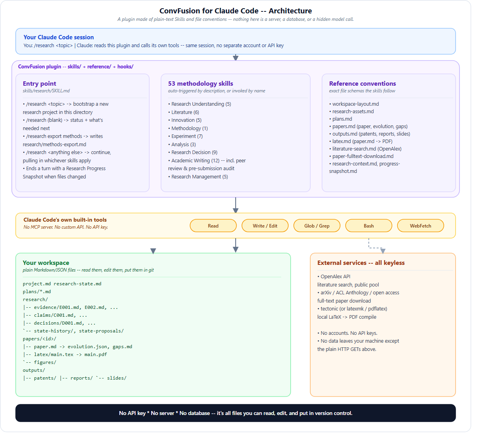

<div align="center">

# ResearchLedger for Claude Code

**A research operating system for Claude Code — 53 peer-reviewed-style research skills, one `/research` entry point, zero API keys.**

[](https://claude.com/claude-code)
[]()
[]()
[]()
[](LICENSE)

</div>

---

ResearchLedger turns Claude Code into a persistent research assistant: it carries a research project
from a first vague idea through literature review, hypothesis and experiment design, evidence and
claim tracking, and all the way to a submitted paper (or a patent, technical report, or slide deck)
— using nothing but plain Markdown/JSON files in your own project directory and Claude Code's
built-in tools. There is no server, no database, and no separate API key: it runs entirely inside
the Claude Code session you're already using.

This is a from-scratch port of the original [ConvFusion](https://github.com/ConvFusion/ConvFusion-dsh)
plugin (built for the DeepSeek Harness agent runtime) onto Claude Code's plugin model — see
[*What changed from the original*](#what-changed-from-the-original-convfusion) below.

## Architecture



Everything below the top band is **just files**: the plugin ships 53 Skills (markdown instructions),
a `reference/` folder of file-format conventions, and one small Python hook (see next section).
Claude follows the skills/reference conventions using its own Read/Write/Edit/Bash/WebFetch tools to
read and write your workspace. Nothing runs as a background service, and nothing requires an
account or API key beyond the Claude Code session itself.

## "Harness style" per-turn context — how it actually works here

The original DeepSeek-Harness ConvFusion re-evaluated a *Research Context* block on **every single
model turn**, injected straight into the system prompt by the Harness runtime itself. Claude Code
has no plugin API that does that automatically — but it does have **hooks**, and this plugin uses
one to get the same effect:

- [`hooks/hooks.json`](hooks/hooks.json) registers a `UserPromptSubmit` hook — Claude Code runs it
  **before every single turn**, no exceptions.
- That hook is [`hooks/inject_research_context.py`](hooks/inject_research_context.py): a small,
  dependency-free Python script. Claude Code hands it the current working directory on stdin; it
  checks whether that directory is a ResearchLedger research workspace (`project.md`,
  `research-state.md`, `research/`, or `.researchledger/` present). If `.researchledger/index.json`
  exists (kept fresh by the `researchledger` CLI — see [Run Ledger](#run-ledger) below), it reads
  that one small cached file; otherwise it falls back to a light scan of `research/evidence/`,
  `research/claims/`, `research/decisions/`, and `research/runs/`. Either way it reports current
  **state** — counts by status, open integrity issues — never a prescribed "current stage": a fixed
  pipeline stage would contradict this plugin's own "no fixed pipeline" design (see below).
- **No model is called and no API key is involved** — this is plain file I/O, done once per turn, in
  well under a second. Claude Code takes that script's stdout and adds it to Claude's context for
  that turn automatically. If the directory isn't a research workspace, or anything goes wrong, the
  script prints nothing and exits cleanly — it never blocks or errors out your prompt.

So unlike the `research` skill (which does a *deep* read of the workspace, but only when you
explicitly invoke it), this hook gives you an *always-on, lightweight* pulse of where the project
stands — genuinely matching the original's "recomputed every turn" behavior, just implemented as a
local script instead of a runtime API that doesn't exist in Claude Code.

Requires Python 3 on your `PATH` (as `python3`). If your system only has `python`, edit the
`command` in `hooks/hooks.json` accordingly.

## Quick start

Run it for a one-off session without installing anything:

```bash
claude --plugin-dir /path/to/ResearchLedger
```

Then, inside Claude Code, in whatever directory you want your research project to live:

```text
/research a cross-modal drone localization method using vision and LiDAR
```

That's it — Claude creates `project.md`, decides what to do first (clarify the question, scan the
literature, sketch an experiment plan — there's no fixed order), and keeps working from there.
Run `/research` with no arguments any time to see status; run it again with new instructions to
continue.

To install it permanently instead of loading it per-session, add it via Claude Code's plugin
marketplace/install flow (see the [plugin docs](https://code.claude.com/docs/en/plugins)) once
you're happy with it — the plugin itself doesn't change based on how it's installed.

## What's inside

```text
ResearchLedger/
├── .claude-plugin/plugin.json     # plugin manifest
├── docs/architecture.svg, .png    # the diagram above
├── hooks/
│   ├── hooks.json                  # registers the per-turn UserPromptSubmit hook
│   └── inject_research_context.py  # the "harness style" auto-context script (see above)
├── skills/
│   ├── research/SKILL.md          # the single entry point — /research, or auto-invoked
│   └── <53 methodology skills>/SKILL.md  [+ reference.md for the more detailed ones]
├── reference/                     # exact file-format schemas the skills read/write against
│   ├── workspace-layout.md         # the directory layout ResearchLedger uses in your project
│   ├── research-assets.md          # project.md, research-state.md, evidence/claims/decisions
│   ├── run-ledger.md               # v2: researchledger CLI, run manifests, validator, tracing
│   ├── plans.md                    # the plans/ lifecycle (draft -> ready -> executing -> ...)
│   ├── papers.md                   # the paper entity: evolution, revision proposals, gaps, maturity
│   ├── outputs.md                  # patents, technical reports, slide decks
│   ├── latex.md                    # paper.md -> main.tex -> compiled PDF
│   ├── literature-search.md        # OpenAlex search, keyless
│   ├── paper-fulltext-download.md  # arXiv / ACL / open-access full-text download, keyless
│   ├── research-context.md         # how /research rebuilds its situational summary on invocation
│   └── progress-snapshot.md        # the end-of-turn "what changed, what's next" report
├── researchledger/                # v2: the run-ledger CLI package (see "Run Ledger" below)
├── schemas/                        # JSON Schemas for run/evidence/claim/decision frontmatter
├── examples/quickstart/            # a real workspace that `validate --strict` passes clean
├── tests/                           # pytest suite for researchledger/ (168 tests, 97% coverage)
├── .github/workflows/ci.yml        # lint + type-check + test + CLI smoke test, 3 OSes x 4 Pythons
└── pyproject.toml                  # packages researchledger/ as the `researchledger` command
```

## Features

- **One command, no fixed pipeline.** `/research` bootstraps, reports status, exports the methods
  library, or continues — natural language decides what happens next, not a rigid workflow engine.
- **53 research-methodology skills**, each auto-triggerable by description or invokable by name,
  spanning topic framing, literature search/screening/review, hypothesis and experiment design,
  evidence/claim analysis, direction and risk decisions, academic writing, peer-review simulation,
  pre-submission editorial audit, and patent/report/slide drafting.
- **Traceable research assets.** Evidence, claims, and decisions are structured, cross-referenced,
  numbered records — not just chat history — so every claim in a paper can be traced back to the
  evidence and the run that produced it.
- **Papers evolve, they don't get overwritten.** Every manuscript change goes through a revision
  proposal, gets versioned, and keeps its full history.
- **Keyless literature search and full-text download.** OpenAlex search and arXiv/ACL/open-access
  PDF retrieval both work with zero credentials, via `WebFetch`/`Bash curl`.
- **Local LaTeX compilation.** `paper.md` compiles to a PDF using whatever's on your machine
  (`tectonic`, falling back to `latexmk` or plain `pdflatex`+`bibtex`).
- **Plain files, real version control.** Every research asset is a Markdown or JSON file you can
  read, diff, edit by hand, and commit to git — there's no database and nothing hidden.
- **Run ledger (v2).** Every executed experiment is an immutable, numbered record — command, git
  commit, environment, timestamps, exit status, metrics, and SHA-256'd artifacts — and a
  deterministic validator/tracer makes the whole claim → evidence → run → artifact chain
  mechanically checkable, not just documented. See below.

## Run Ledger

`researchledger` is a standalone, typed, tested Python package (`researchledger/`, `pip install -e
.` from this repo) that makes **paper statement → claim → evidence → run → metrics → raw
artifact** a mechanically checked chain instead of a documented convention:

```bash
researchledger init
researchledger run --seed 42 --data data/imagenet-c -- python train.py --config configs/base.yaml
researchledger evidence create --from-run R0001 --supports C001   # graph-consistent by construction
researchledger validate --strict     # CI-friendly: RL-coded errors, exits non-zero on any
researchledger trace C001            # paper.md -> C001 -> E001 -> R0001 -> metrics.json -> SHA-256 ✓
researchledger reproduce R0001 --repeat 5   # isolated worktree, compared against the observed spread
researchledger report                # integrity summary: cross-references, run-backed evidence, ...
```

Try it now without setting anything up: `cd examples/quickstart && researchledger validate
--strict` — a real, shipped workspace that passes clean, 100% on every metric.

Full command reference (`init`, `run`, `validate`, `report`, `trace`, `inspect`, `reproduce`,
`index`, `migrate`, `evidence create`, `validate-paper`), the run-manifest schema, the full
RL-coded validator rule catalog (including the tamper-evident run chain), the evidence/claim
status vocabulary, and the manuscript provenance-marker syntax are all in
[`reference/run-ledger.md`](reference/run-ledger.md).

Quality, as actually run in this repo: 168 tests / 97% statement coverage
(`pytest --cov=researchledger`), clean `ruff` and `mypy`, zero known vulnerabilities in its two
runtime dependencies (`pip-audit`), a shipped example workspace that validates clean (checked by
`tests/test_examples.py`, not just by hand), and a 3-OS × 4-Python CI matrix
([`.github/workflows/ci.yml`](.github/workflows/ci.yml)) that also runs an `init` → `run` →
`validate --strict` → `report` smoke test plus the shipped example's own validation.

It borrows a few mature engineering ideas from
[AutoResearch](https://github.com/raja21068/AutoResearch)'s sandbox runner (execution capture,
environment recording, resource controls, metric collection) without pulling in its multi-agent
orchestrator — this stays a plain, typed CLI, not a service.

## Skills catalog

<!-- SKILLS_CATALOG_START -->
<details>
<summary><strong>Research Understanding</strong> (5 skills)</summary>

| Skill | What it does |
|---|---|
| `problem-definition` | Convert a research interest into a falsifiable research problem: a question whose answer would change what we do, and which could turn out to be false. |
| `research-domain-profiling` | Infer a researcher's domains and their confidence from how they describe their own work, so that direction choice can be matched to real strengths. |
| `research-foundation-assessment` | Assess the methodological foundation behind a researcher's stated skills, distinguishing claimed skills from demonstrated ones. |
| `research-intent-assessment` | Judge whether an input is a genuine research request, a direction suggestion, or ordinary dialogue — and decide how much research machinery it warrants. |
| `topic-understanding` | Turn an unstructured input — a paper, repository, dataset, conversation, half-formed idea — into a precise statement of what is actually being researched: its source type, domain, and substantive content. |

</details>

<details>
<summary><strong>Literature</strong> (6 skills)</summary>

| Skill | What it does |
|---|---|
| `literature-review` | Build an evidence-backed understanding of a research area — tasks, problems, methods, evidence, contradictions — rather than a list of paper summaries. |
| `literature-screening` | Decide which retrieved works actually belong in the corpus, using stated criteria rather than relevance impressions, so that later synthesis rests on a defensible set. |
| `literature-search` | Turn a research question into an executable retrieval strategy, and judge when the retrieved corpus is sufficient — rather than stopping at the first page of results. |
| `paper-fulltext-download` | Fetch the full text of a paper into the workspace as a numbered file, so that datasets, baselines, metrics and experimental settings — which only appear in the full text, never in the abstract — can be extracted for benchmark and baseline analysis. |
| `research-landscape` | Synthesise the reviewed literature into a landscape: what is settled, what is contested, what is moving — the picture a newcomer needs to place a contribution. |
| `systematic-literature-synthesis` | Build a large, recent literature corpus (40-100 papers, last 2-3 years) into comparable structured evidence records, synthesize the patterns across the whole corpus, and derive a gap inventory whose every entry has survived a deliberate attempt to kill it — so "few studies have explored X" is never mistaken for a finding. |

</details>

<details>
<summary><strong>Innovation</strong> (5 skills)</summary>

| Skill | What it does |
|---|---|
| `contribution-design` | State what the field gains if the work succeeds, and design the evidence package that demonstrates each claim instead of merely asserting it. |
| `hypothesis-formulation` | Turn a selected idea into a hypothesis precise enough to be wrong: named variables, a comparison, a predicted effect worth caring about, and the conditions under which it holds. |
| `idea-novelty-assessment` | Judge how much of an idea is actually new by locating each claim-bearing part of it against the closest prior work, rather than scoring novelty from the proposal wording. |
| `innovation-gap-analysis` | Turn a literature landscape into the specific unresolved problems, methodological limitations and contradictions that a contribution could target — and separate structural gaps from areas that are merely unfamiliar to you. |
| `research-idea-generation` | Produce a portfolio of genuinely distinct candidate research ideas, each attacking a named gap through a stated mechanism — instead of several rewordings of one idea. |

</details>

<details>
<summary><strong>Methodology</strong> (1 skill)</summary>

| Skill | What it does |
|---|---|
| `research-method-design` | Convert a committed research strategy into a concrete, testable method: the paradigm, the learning setting, the intervention, the training protocol and the data it requires, stated so that a third party could implement it and know what would falsify it. |

</details>

<details>
<summary><strong>Experiment</strong> (7 skills)</summary>

| Skill | What it does |
|---|---|
| `ablation-design` | Design the experiments that show which part of a method causes the effect, so a gain is attributed to a mechanism rather than to the whole system, extra capacity, or tuning luck. |
| `baseline-selection` | Choose the comparisons that make a result meaningful: the strongest published methods on the same task plus trivial and structural controls, each run under one protocol so differences are attributable to the method. |
| `dataset-selection` | Choose datasets that can actually support the claim — right construct, right scale, right licence, obtainable — and specify the preprocessing, splitting and statistics the pipeline must produce so the data is auditable. |
| `evaluation-protocol` | Decide what is measured, how each metric is computed, and what counts as success, so that a number produced by the pipeline can be trusted as evidence about the hypothesis. |
| `experiment-design` | Decide whether a research question can be tested experimentally at all, then fix a design whose outcome would be interpretable: what is manipulated, what is held fixed, what is measured, and what result would falsify the hypothesis. |
| `reproducible-implementation-spec` | Turn a settled design into implementation requirements precise enough that an independent run reproduces the numbers: pinned environment, controlled randomness, deterministic data handling, complete configuration, and a fixed artefact layout. |
| `simulation-baseline` | Produce expected results when the real experiment cannot be run yet — hardware, data or lab access unavailable — as explicit, labelled predictions anchored on published numbers and the baselines, so that design decisions and the expected margin over baselines can be judged before execution, and so that no simulated value ever masquerades as a measurement. |

</details>

<details>
<summary><strong>Analysis</strong> (3 skills)</summary>

| Skill | What it does |
|---|---|
| `comparative-analysis` | Decide whether observed differences between methods are real and meaningful — same protocol, quantified uncertainty, significance where the design supports it — instead of reading a ranking off a single table. |
| `evidence-assessment` | Judge whether the experiment as executed actually produced the evidence its claims need, and locate the weakest link when it did not — the checkpoint before results become paper text. |
| `result-analysis` | Turn raw run outputs into defensible findings: what the numbers say against the pre-declared thresholds, which figures the argument needs, and what the study cannot conclude. |

</details>

<details>
<summary><strong>Research Decision</strong> (9 skills)</summary>

| Skill | What it does |
|---|---|
| `feasibility-cost-and-resource-plan` | Determine whether a research plan can actually be executed within the available resources, and what it will cost, expressed in units that can be checked — compute, data, storage, skills, time and money. |
| `go-no-go-decision` | Convert the multi-dimensional evaluations into a committed go, no-go or conditional go — with gates checked first, risk weighed against reward, and next actions whose progress can be observed. |
| `plan-risk-assessment` | Stress-test a research plan before it is executed: surface the assumptions it rests on, classify the risks that would invalidate it, and decide whether it is executable under the current constraints, including the honest answer that it is not. |
| `research-direction-selection` | Choose which direction to commit to from an evaluated portfolio, with the criteria and trade-offs recorded so the choice can be defended or revisited rather than re-argued from scratch. |
| `research-direction-steering` | Guide a researcher from a vague interest toward concrete, researchable directions — without prescribing a workflow, and without pretending the first candidate is the answer. |
| `research-direction` | Move from a set of candidate directions to one committed direction, with the reasoning recorded so later decisions can be understood in their original context. |
| `research-risk-assessment` | Identify what could make the plan fail or make its result unusable, separate risk from missing fact, and attach a mitigation and a detectable early signal to each risk that is kept. |
| `research-topic-ranking` | Rank candidate research topics on separated dimensions and state the reasoning, so that the choice can be revisited rather than re-argued. |
| `venue-fit-decision` | Decide whether the assembled evidence supports a full-length journal submission or only a focused conference paper, and commit to the template and effort that follow from that decision. |

</details>

<details>
<summary><strong>Academic Writing</strong> (12 skills)</summary>

| Skill | What it does |
|---|---|
| `equation-formalization` | Convert prose descriptions of mathematics into a typed, uniquely labelled equation set that renders deterministically and stays consistent with the notation used in the surrounding text. |
| `manuscript-revision` | Raise a complete draft to a consistent, formal academic register without changing a single claim, number, citation or placeholder — and keep the change set auditable. |
| `paper-architecture` | Decide the section skeleton, the scope and length budget of each section, and the order in which sections are written — before any prose exists, so that sections cannot overlap or drift in length. |
| `patent-drafting` | Transform a research result into a patent draft: restate it as a technical problem, a technical solution with features, the effects it produces, and embodiments a skilled person could carry out. |
| `peer-review-simulation` | Produce a rigorous, construct-level peer-review critique of a manuscript in the voice of a senior, non-emotional academic reviewer for a high-level journal — auditing journal/genre fit, construct clarity, novelty against existing literature, evidence and citation depth, mechanistic specificity, and predictive/empirical viability, with every critique anchored to an exact manuscript location. |
| `pre-submission-editorial-audit` | Simulate a journal handling editor, subject specialist, and research-methods auditor conducting an author-side pre-submission assessment — testing whether the manuscript is a meaningful, verifiable contribution supported by appropriate evidence, and screening for contemporary risks (LLM-assisted research and writing, unreliable citations, benchmark contamination, synthetic results presented as findings, publication-integrity concerns) without ever inferring fraud from prose style alone. |
| `presentation-design` | Turn a research result into a talk that carries one argument: what problem, why prior answers fail, what was done, what was found, and what it means. |
| `research-narrative` | Build the single argument the paper makes — problem, prior limitations, gap, insight, solution — and bind every cited work and every claimed contribution to a specific role in that argument. |
| `section-drafting` | Turn the research state into complete section prose that respects each section's function, length budget and citation contract, with every quantitative statement traceable to a result. |
| `submission-compile-and-format` | Turn the revised text into a venue-conformant manuscript that compiles: correct LaTeX, escaped special characters, a reference list built from real metadata, and no leftover markup artefacts. |
| `technical-report-writing` | Document a research result so a colleague can reproduce or build on it: what was done, how, what was found, what it does not cover, and how to rerun it. |
| `visual-evidence-selection` | Choose which figures belong in the paper so that each one carries information the tables and prose do not, and so the figure count stays within the venue limit. |

</details>

<details>
<summary><strong>Research Management</strong> (5 skills)</summary>

| Skill | What it does |
|---|---|
| `experiment-pipeline-design` | Decompose a designed method into an executable, dependency-ordered plan: stages, steps, inputs, outputs, tools, time and the artifact each step must produce, so the work can be scheduled, parallelised and reviewed step by step. |
| `infrastructure-cost-selection` | Turn an audited resource requirement into costed, feasibility-checked infrastructure options and one recommended plan that respects budget, deadline and data-governance constraints, with the rejected options and their prices kept on record. |
| `research-process` | Define the stages a research project passes through, and what counts as evidence that a stage has actually landed — so capability selection and progress reporting reflect a real research process rather than a fixed pipeline. |
| `research-strategy-portfolio` | Decide which research strategies the project should actually pursue, as a deliberate risk-diversified portfolio rather than one bet, and then consolidate the surviving plans into a single committed strategy with a validation protocol and a reproducibility contract. |
| `resource-requirement-estimation` | Estimate what a plan demands in hardware-agnostic terms, namely compute, storage, data, human skills and time by phase, and identify the binding bottleneck and the scaling behaviour before any vendor or part number is chosen. |

</details>
<!-- SKILLS_CATALOG_END -->

## Your workspace, in plain files

Nothing ResearchLedger tracks lives in a database. A project looks like this on disk (see
[`reference/workspace-layout.md`](reference/workspace-layout.md) for the full spec):

```text
project.md, research-state.md          research definition + current state
plans/*.md                              plans for this research (draft -> ready -> executing -> ...)
research/
├── evidence/E001.md, ...               confirmed scientific evidence, cross-referenced to claims
├── claims/C001.md, ...                 scientific claims, cross-referenced to evidence
├── decisions/D001.md, ...              research decisions and why they were made
└── runs/R0001/, ...                    immutable run records (v2) — see run-ledger.md
papers/<id>/
├── paper.md                            the manuscript (the only required file)
├── latex/main.tex -> main.pdf           compiled via tectonic / latexmk / pdflatex
└── evolution.json, gaps.md, ...        revision history and gap analysis
outputs/
├── patents/   ├── reports/   └── slides/
```

## Customizing a skill

There's no override file or settings UI to learn — edit a skill's `SKILL.md` (or its
`reference.md`) directly, in this plugin's own directory or in a fork. The change takes effect on
the next invocation.

## What changed from the original ConvFusion

The original [ConvFusion](https://github.com/ConvFusion/ConvFusion-dsh) is built on DeepSeek Harness's own plugin APIs: per-turn
system-prompt injection, a native skill-provider registry, custom tool definitions, a settings UI,
and RPC routes. None of that exists in Claude Code, so this port:

- Ships the same research methodology as **Claude Code Skills** (markdown + frontmatter) instead of
  a custom skill-provider registration.
- Replaces custom "tools" with **plain file conventions**, documented in [`reference/`](reference),
  that Claude follows using its own Read/Write/Edit/Bash/WebFetch tools — no MCP server, no daemon.
- Reproduces automatic per-turn context injection with a **`UserPromptSubmit` hook**
  ([`hooks/inject_research_context.py`](hooks/inject_research_context.py)) instead of a runtime
  system-prompt API — see *"Harness style" per-turn context* above. The `research` skill still does
  a deeper, on-demand read of the workspace (see
  [`reference/research-context.md`](reference/research-context.md)) when explicitly invoked; the
  hook is the lightweight, always-on version of the same idea.
- Drops the native settings UI, RPC surface, and in-memory session-event bridge — configuration is
  now just "edit a file."
- Literature search (OpenAlex) and full-text download (arXiv/ACL/open access) both work **without
  any API key**, using `WebFetch`/`Bash curl` directly.
- LaTeX compilation shells out to whatever's installed (`tectonic`, falling back to `latexmk` or
  plain `pdflatex`+`bibtex`) — see [`reference/latex.md`](reference/latex.md).

Three skills were added that weren't in the original: **`peer-review-simulation`** (a
construct-level adversarial peer review), **`pre-submission-editorial-audit`** (an
editorial/integrity pre-submission screen), and **`systematic-literature-synthesis`** (building a
40-100 paper literature universe into structured, comparable evidence and a gap inventory that
survives a deliberate "kill fake gaps" validation before any gap is trusted).

## What's new in v2: production-grade provenance, not more features

v1 tracked evidence as Markdown files with a `raw_artifacts` path string — trustworthy only in
that nobody had reason to doubt it, evidence/claim status was five loose words shared between two
different kinds of thing, and the per-turn hook re-scanned the whole workspace and prescribed a
fixed "current stage." v2's guiding rule was **stricter, not bigger**:

- **Typed, schema-validated entities.** Evidence/claims/decisions carry `schema_version`, real
  YAML arrays instead of comma-strings, and are checked against JSON Schemas
  (`schemas/*.schema.json`, via the `jsonschema` package) — a malformed record fails validation
  (`RL003`) instead of being silently accepted.
- **A disjoint status vocabulary that can't lie about verification.** Evidence:
  `proposed → observed → checked → verified`, or `contradicted`/`invalidated`/`superseded`. Claims:
  `hypothesis → provisional → supported`, or `mixed`/`contradicted`/`withdrawn` — deliberately
  different words, so a claim can never inherit "verified" from one experiment completing.
  `recompute_claim_status` derives a claim's status from its evidence deterministically; the
  validator flags disagreement (`RL310`) and `--strict` fails the build on it.
- **An immutable run ledger with graph-shape constraints enforced, not just tracked.** Every run
  records command, git commit + dirty state, environment + a digest of it, hardware, an
  explicit-allowlist-only slice of env vars, seed, timing, exit code, and SHA-256'd artifacts —
  written entirely by `researchledger run`'s own code, never by an LLM. `RL111` fails validation if
  experimental evidence has no run; `RL211` fails it if the run evidence relies on didn't exit 0.
- **An RL-coded validator with real severity semantics** (`researchledger/codes.py`): baseline
  errors always fail the build; a fixed, documented set of warnings (`RL302`, `RL310`) escalate to
  errors under `--strict`; everything else stays advisory. `validate`/`run`/`migrate` fail closed
  (exceptions propagate, exit codes are meaningful); the per-turn context hook still fails open —
  see [`reference/run-ledger.md`](reference/run-ledger.md#fail-open-vs-fail-closed) for why that
  split is deliberate.
- **Provenance tracing in both directions.** `researchledger trace C014` walks forward to the run
  and artifact; `researchledger trace R0042` walks *backward* to every evidence record, claim, and
  manuscript section that depends on that run.
- **Reproducibility as something that actually runs**, not a stored string:
  `researchledger reproduce R0042` checks out the run's exact git commit into an isolated worktree,
  re-executes, and compares metrics and artifact hashes against the original — `REPRODUCED ✓` or
  not, with the specific mismatch shown. `--repeat N` reuses that same worktree for `N` runs and
  compares against the observed spread (`mean ± max(tolerance, z·stddev)`) instead of one point,
  for anything with real run-to-run noise; `--data <path>` content-hashes input datasets into the
  manifest the same way artifacts are hashed on the way out, so a silently-changed dataset shows up
  as a validation failure, not a silent discrepancy.
- **A tamper-evident run chain.** Every run's manifest records the SHA-256 of the immediately
  preceding run's manifest — the same idea as a git commit chain, applied to run history. Hand-edit
  an old run's manifest and the next run's recorded hash of it no longer matches; `validate` catches
  the break (`RL220`) and names which run detected it. Costs nothing extra to produce or check.
- **Manuscript provenance auditing.** `researchledger validate-paper paper.md` counts a
  manuscript's quantitative assertions and reports how many are linked to claims, backed by
  verified evidence, backed by reproducible runs, unsupported, or resting on stale evidence.
- **A v1 → v2 migration tool**, not a breaking change: `researchledger migrate --from v1
  [--dry-run]` backs up first, rewrites the schema, and recomputes (never blindly renames) claim
  status from the migrated evidence, flagging anything malformed for manual review instead of
  aborting the batch.
- **Transactional writes and a cached index.** Every ledger file is written via a temp-file +
  `fsync` + atomic rename, with an advisory lock around run-id allocation so concurrent runs can't
  collide. The context hook reads one small `.researchledger/index.json` instead of re-scanning the
  whole workspace every turn — and reports *state*, never a prescribed pipeline stage, which was
  the direct contradiction v1's hook had with this plugin's own "no fixed pipeline" design.
- **The CLI is wired into the skills, not just available next to them.** `research` bootstraps the
  ledger and surfaces `researchledger report` in its status view; `experiment-design` routes real
  execution to `researchledger run`; `reproducible-implementation-spec` specifies runs in terms of
  it (`--seed`, `--data`, and verifies via `researchledger reproduce`) instead of describing an
  equivalent directory layout by hand; `evidence-assessment` audits via `researchledger
  trace`/`validate` and creates evidence via `researchledger evidence create`. A tool nothing calls
  is just a tool that exists.
- **A shipped example, not just tests.** [`examples/quickstart/`](examples/quickstart/) is a real,
  small workspace where `validate --strict` and `validate-paper` both pass clean out of the box —
  `tests/test_examples.py` keeps it that way.

This selectively reuses AutoResearch's mature execution-capture ideas (sandboxed-enough run
wrapper, environment recording, timeout/retry controls, metrics extraction) but deliberately does
**not** import its multi-agent orchestrator, planner, or paper-writer — those overlap with what the
skills above already do as plain-file conventions, and pulling in a second agent framework would
undermine the "no server, no daemon" design this plugin is built around. See
[`reference/run-ledger.md`](reference/run-ledger.md) for the full spec, including what's explicitly
scoped out (unattended execution, automatic retry-with-different-hyperparameters, judging whether
evidence is "enough" — that stays with the skills and the human).

## License

MIT — see [`LICENSE`](LICENSE).
