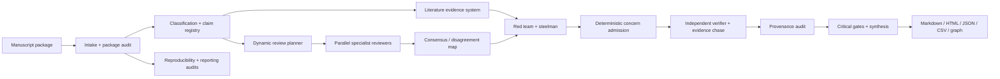

# Architecture overview

Referee separates the scientific review kernel from platform infrastructure. The kernel is responsible for claim registration, evidence anchoring, specialist review, red-team/steelman checks, concern admission, independent verification, critical gates, and synthesis. The platform supplies ingestion, scholarly retrieval, reporting-guideline routing, revision comparison, reproducibility auditing, exports, observability, APIs, and evaluation.

The evidence-lock invariant is preserved across every review mode: a major or critical concern must be tied to known manuscript or external evidence, identify the affected claim, explain the failure mechanism and scientific consequence, define a minimum remedy, and expose a testable closure criterion.
